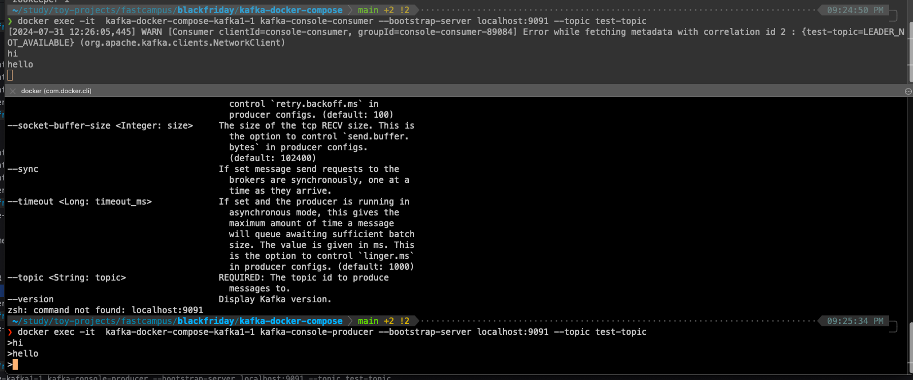

```text
docker compose up

docker exec -it  kafka-docker-compose-kafka1-1 kafka-console-producer --bootstrap-server localhost:9091 --topic test-topic

docker exec -it  kafka-docker-compose-kafka1-1 kafka-console-consumer --bootstrap-server 
localhost:9091 --topic test-topic
```

- `kafka-console-producer`: 
  - Kafka에 포함된 콘솔 프로듀서 스크립트. 
  - 터미널에서 직접 메시지를 Kafka 토픽에 보내기 가능.
- `--bootstrap-server localhost:9091`
  - 카프카 브로커의 주소와 포트 지정.
  - 컨테이너 내부에서 실행되므로 'localhost'로 지정. 
- `--topic test-topic`: 메시지를 보낼 토픽 이름.



- producer 에서 consumer로 메시지 보내기